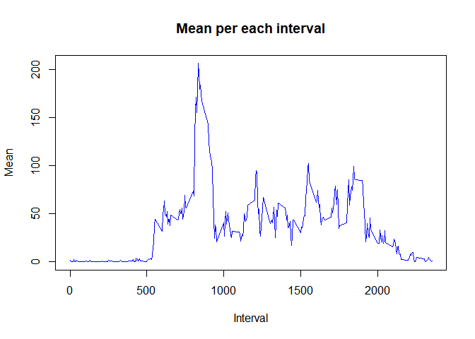
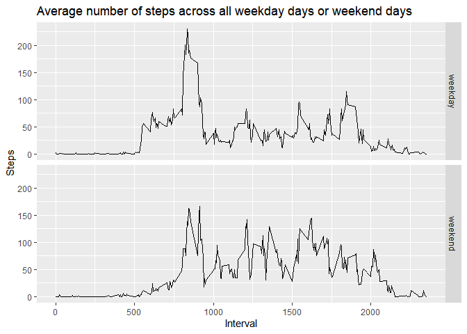

## Loading and preprocessing the data


```r
data <- read.csv("activity.csv")
data$date <- as.Date(data$date)
```

## What is mean total number of steps taken per day?

### Histogram

```r
#remove NA values
wna_data <- data[!is.na(data$steps),]
#calculate total number of steps per day
total <- with(wna_data,
              tapply(wna_data$steps,
                     wna_data$date,
                     sum))
hist(total,
     col="green",
     main="Total number of steps taken per day",
     xlab="Steps")
```

<!-- -->

### Mean total number of steps per day

```r
mean(total)
```

```
## [1] 10766.19
```

### Median total number of steps per day

```r
median(total)
```

```
## [1] 10765
```

## What is the average daily activity pattern?

### Time series plot

```r
# calculate the average number of steps taken, averaged across all days  
mean <- with(wna_data,
             tapply(wna_data$steps,
                    wna_data$interval,
                    mean))
# make plot 
xaxial <- unique(data$interval)
plot(as.numeric(xaxial),
     mean,
     col="blue",
     type="l",
     main="Mean per each interval",
     xlab= "Interval",
     ylab="Mean")
```

<!-- -->

### 5-minute interval, who have the maximun average of steps 


```r
names(mean[mean==max(mean)])
```

```
## [1] "835"
```

## Imputing missing values

### Total number of rows with NAs

```r
na_rows <- data$steps[is.na(data$steps)]
length(na_rows)
```

```
## [1] 2304
```

### Dataset with the missing data filled in


```r
fna_data <- data
for (i in 1:17568) {
  row <- data[i,]
  if (is.na(row$steps)) {
    fna_data$steps[i] <-  round(mean[as.character(row$interval)])
  }
}
```

### Histogram


```r
#calculate total number of steps per day
total2 <- with(fna_data,
              tapply(fna_data$steps,
                     fna_data$date,
                     sum))
hist(total2,
     col="green",
     main="Total number of steps taken per day",
     xlab="Steps")
```

<!-- -->

### Mean total number of steps per day

```r
mean(total2)
```

```
## [1] 10765.64
```

### Median total number of steps per day

```r
median(total2)
```

```
## [1] 10762
```

## Are there differences in activity patterns between weekdays and weekends?


```r
# add new column
days <- NULL
for (n in 1:17568) {
  row2 <- weekdays(fna_data$date[n])
    if (row2 == "domingo" | row2 == "sábado") {
      valfac <- "weekend"
    }else{
      valfac <- "weekday"
    }
  days <- c(days,valfac)
}
fna_data <- cbind(fna_data,days=days)

# create data frame 
wd <- with(fna_data,tapply(steps[days=="weekday"],interval[days=="weekday"],mean))
wd_data <- with(fna_data,cbind(mean = wd,interval=unique(interval),days="weekday"))

we <- with(fna_data,tapply(steps[days=="weekend"],interval[days=="weekend"],mean))
we_data <- with(fna_data,cbind(mean = we,interval=unique(interval),days="weekend"))

wdata <- as.data.frame(rbind(wd_data,we_data),row.names = FALSE)
wdata$mean <- as.numeric(wdata$mean)
wdata$interval <- as.numeric(wdata$interval)
wdata$days <- factor(wdata$days)

# make the plot
library(ggplot2)
```

```
## Warning: package 'ggplot2' was built under R version 4.0.2
```

```r
qplot(interval,
      mean,
      data = wdata,
      facets = days~.,
      geom = "line",
      main = "Average number of steps across all weekday days or weekend days",
      xlab = "Interval",
      ylab = "Steps")
```

<!-- -->

